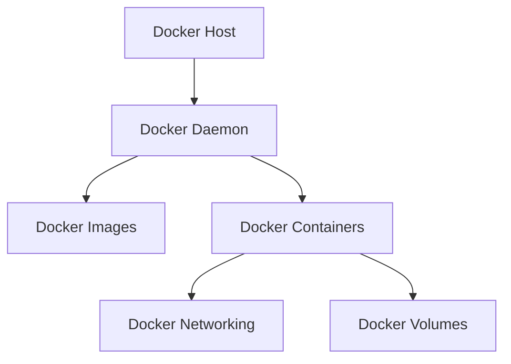
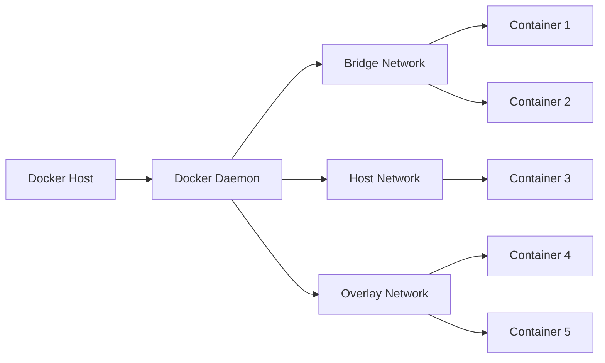

## Docker Architecture Overview

The Docker architecture consists of the following key components:

- **Docker Host**: The physical or virtual machine running the Docker daemon.
- **Docker Daemon**: The core of the Docker system, responsible for managing Docker objects like images, containers, networks, and volumes.
- **Docker Images**: Read-only templates used to create Docker containers.
- **Docker Containers**: Runnable instances of Docker images.
- **Docker Networking**: Handles communication between containers and the outside world.
- **Docker Volumes**: Provide persistent storage for container data.

## Docker Container Lifecycle

The typical lifecycle of a Docker container includes the following stages:

1. **Create Container**: A new container is created from a Docker image.
2. **Start Container**: The created container is started.
3. **Run Container**: The container runs and executes its intended workload.
4. **Stop Container**: The running container is stopped.
5. **Remove Container**: The stopped container is removed from the system.

## Docker Networking

Docker provides several networking options to enable communication between containers, the host, and external networks:

- **Bridge Network**: The default network created for containers, allowing them to communicate within the same host.
- **Host Network**: Containers can directly access the network interfaces of the Docker host.
- **Overlay Network**: Enables communication between containers across multiple Docker hosts.