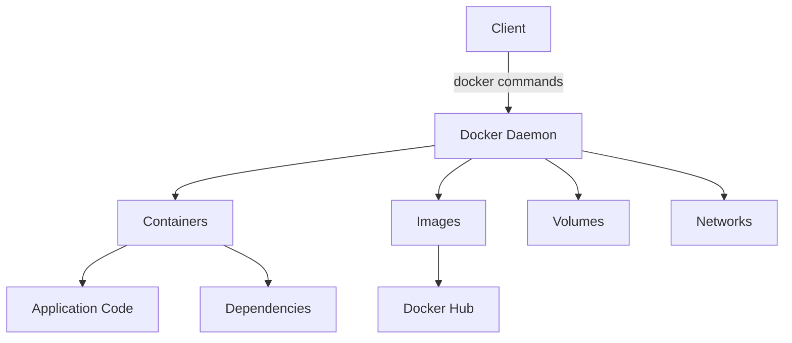

# Docker: An Overview

Docker is a platform that enables developers to automate the deployment, scaling, and management of applications within lightweight, portable containers. These containers encapsulate an application and its dependencies, allowing it to run consistently across different environments.

## Key Concepts

### 1. **Docker Engine**
The Docker Engine is the core of the Docker platform. It is a client-server application with the following major components:
- **Server**: A long-running process called a daemon (`dockerd`) that manages Docker objects such as images, containers, networks, and volumes.
- **REST API**: Interfaces with the daemon to control it and perform operations.
- **Client**: A command-line interface (`docker`) used by users to interact with Docker.

### 2. **Docker Images**
- Docker images are read-only templates used to create containers. An image is a lightweight, stand-alone, and executable package that includes everything needed to run a piece of software, including the code, a runtime, libraries, environment variables, and configuration files.
- **Layers**: Docker images are composed of layers. Each layer represents an instruction in the image’s Dockerfile. When an image is updated, only the layers that have changed are rebuilt, making the process efficient.

### 3. **Docker Containers**
- A Docker container is a runnable instance of a Docker image. You can start, stop, move, or delete a container using Docker’s API or CLI.
- Containers are isolated from one another and from the host system. However, they can communicate with each other through well-defined channels.

### 4. **Dockerfile**
- A Dockerfile is a text document that contains all the commands a user could call on the command line to assemble an image. Using `docker build`, users can create an automated build that executes several command-line instructions in succession.

### 5. **Docker Hub**
- Docker Hub is a cloud-based repository where Docker users can store and share Docker images. It serves as the default registry from which the `docker pull` command retrieves images.

### 6. **Volumes**
- Volumes are used to persist data generated by and used by Docker containers. Unlike bind mounts, volumes are managed by Docker and offer features like cross-platform consistency.

## Docker Workflow

1. **Write a Dockerfile**: Define the environment in which your application will run.
2. **Build the Docker Image**: Use `docker build` to create an image from the Dockerfile.
3. **Run a Container**: Use `docker run` to start a container from an image.
4. **Manage Containers**: Start, stop, and remove containers using `docker` commands.
5. **Push to Docker Hub**: Upload your image to Docker Hub with `docker push` for sharing.

## Sample Docker Commands

```bash
# Build an image from a Dockerfile
docker build -t myimage:latest .

# List all Docker images
docker images

# Run a container from an image
docker run -d -p 8080:80 myimage:latest

# List running containers
docker ps

# Stop a container
docker stop <container_id>

# Remove a container
docker rm <container_id>

# Push an image to Docker Hub
docker push myusername/myimage:latest
```




Docker image is a read-only template that contains instructions for creating a Docker container, while a Docker container is a runtime instance of that image that runs an application