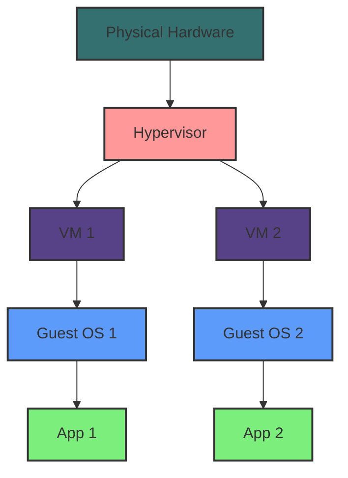

# Hypervisor vs Docker

## Key Differences

| Aspect | Hypervisor | Docker |
|--------|------------|--------|
| **Virtualization Level** | Hardware virtualization | Operating system virtualization |
| **Resource Overhead** | Higher | Lower |
| **Isolation** | Strong (separate kernel for each VM) | Lighter (shared kernel) |
| **Boot Time** | Slower (full OS boot) | Faster (process startup) |
| **Storage Efficiency** | Less efficient (full OS per VM) | More efficient (shared OS components) |
| **Use Case** | Running multiple OS types | Running multiple applications on same OS type |

## Hypervisor Architecture

## Docker Architecture

```mermaid
graph TD
    A[Physical Hardware] --> B[Host OS]
    B --> C[Docker Engine]
    C --> D[Container 1]
    C --> E[Container 2]
    D --> F[App 1]
    E --> G[App 2]
    
    style A fill:#357070,stroke:#333,stroke-width:2px
    style B fill:#5d9bfb,stroke:#333,stroke-width:2px
    style C fill:#ff9999,stroke:#333,stroke-width:2px
    style D fill:#2c2857,stroke:#333,stroke-width:2px
    style E fill:#2c2857,stroke:#333,stroke-width:2px
    style F fill:#7cee7c,stroke:#333,stroke-width:2px
    style G fill:#7cee7c,stroke:#333,stroke-width:2px
```

## Detailed Comparison

### 1. Virtualization Approach
- **Hypervisor**: Uses hardware virtualization to create multiple virtual machines, each with its own operating system.
- **Docker**: Uses containerization, which visualizes the operating system, allowing multiple containers to share the same OS kernel.

### 2. Resource Utilization
- **Hypervisor**: Each VM requires its own OS, leading to higher resource consumption.
- **Docker**: Containers share the host OS kernel, resulting in lower resource overhead.

### 3. Isolation
- **Hypervisor**: Provides strong isolation as each VM has its own kernel and resources.
- **Docker**: Offers lighter isolation, as containers share the host kernel but have separate users pace.

### 4. Portability
- **Hypervisor**: VMs are less portable due to their size and full OS requirements.
- **Docker**: Containers are highly portable and can run on any system with a compatible host OS and Docker installed.

### 5. Performance
- **Hypervisor**: Generally has more overhead due to running multiple OSes.
- **Docker**: Usually better performance due to shared OS and lower overhead.

### 6. Use Cases
- **Hypervisor**: Ideal for running applications that require different operating systems or complete isolation.
- **Docker**: Best for microservices, application packaging, and scenarios where multiple instances of the same application need to run efficiently.

## Conclusion

While both hypervisors and Docker provide virtualization solutions, they serve different purposes and have distinct advantages. Hypervisors offer stronger isolation and the ability to run different operating systems, making them suitable for scenarios requiring diverse environments. Docker, on the other hand, provides a lightweight, efficient, and portable solution for deploying applications, particularly in microservices architectures and cloud environments.

The choice between hypervisors and Docker depends on specific use cases, security requirements, and the nature of the applications being deployed.