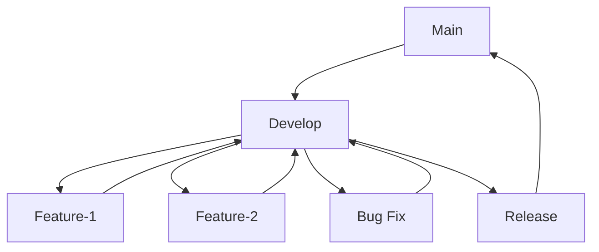

 **Mainline Development (Always Be Integrating)**:
    - Minimal branches, continuous integration of small changes.
    - Requires high testing standards.
**Branch-per-task Model**:
    - Separate branches for new features, experiments, bug fixes, and releases.

## Long-Running vs Short-Lived Branches

- **Long-Running Branches**:
    - Exist throughout the life-cycle of a project (e.g., `main`, `develop`).
    - Typically do not receive direct commits; integration happens via merges.
- **Short-Lived Branches**:
    - Created for a specific purpose (e.g., new feature, bug fix).
    - Deleted after integration.
