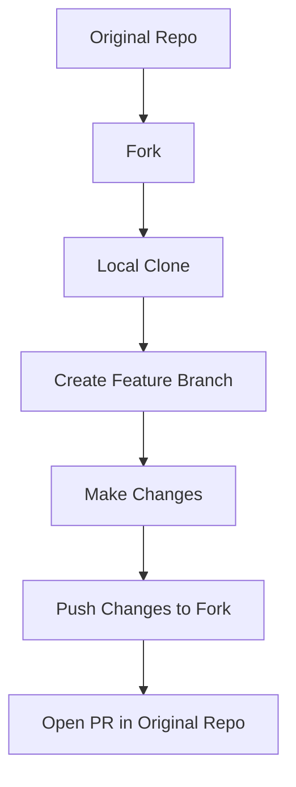

## Pull Requests

- **Why use PRs?**
    - Code review and feedback before merging.
    - Required for contributing to repositories you don't have direct access to.
- **Forking**: Create your own copy of a repository for making changes, and then open a PR to suggest these changes for integration.

## Merge Conflicts

- **When do conflicts occur?**
    - Conflicting changes in the same line of code in different branches.
- **Steps to Resolve**:
    1. Identify the conflict (Git shows it clearly).
    2. Choose the correct changes by editing the file manually or using a merge tool.
    3. Commit the resolved changes.